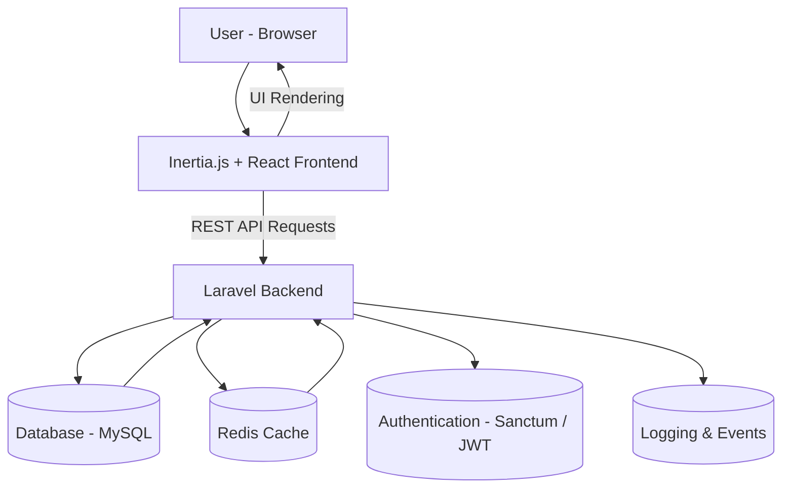

# 🚘 X-Motors

[](#license)
[]()
[]()
[]()

> A modern automotive management platform built with **Laravel**, **Inertia.js**, **React**, and **TailwindCSS**.  
> Provides a clean, reactive experience for managing vehicles, bookings, users, and operations — powered by **Redis caching** and a RESTful API.

---

## 🖥️ Overview

**X-Motors** is a full-stack monolithic application designed for car dealerships, rental businesses, and fleet management.  
It offers a seamless experience with a Laravel backend, React-powered frontend, and real-time UI updates via Inertia.js.

---

## 🧱 Tech Stack

| Layer | Technology |
|-------|-------------|
| Backend | Laravel 11 (REST API) |
| Frontend | Inertia.js + React + Vite + TailwindCSS |
| Database | MySQL / PostgreSQL |
| Cache | Redis |
| Auth | Laravel Sanctum / JWT |
| Deployment | Docker / Laravel Sail / Nginx |
| Build Tools | Vite, npm, artisan |

---

## ✨ Features

- 🧾 RESTful API with Laravel  
- 🖥️ Reactive UI built with Inertia + React  
- 🎨 Modern styling via TailwindCSS  
- ⚡ Fast performance with Redis caching and image compression  
- 👤 Authentication & role-based permissions  
- 🚗 CRUD for cars, brands, users, and bookings  
- 💰 Payment-ready backend structure  
---

## 🗺️ Architecture Diagram


# ⚙️ Installation
1️⃣ Clone Repository
```bash
git clone https://github.com/AbdullahBakouni/X-Motors.git
cd X-Motors
```
2️⃣ Install Dependencies
Backend
```bash
composer install
```
Frontend
```bash
npm install
```
3️⃣ Environment Configuration

Create .env file in the project root:
```env
APP_NAME="X-Motors"
APP_ENV=local
APP_KEY=
APP_DEBUG=true
APP_URL=http://localhost

# Database
DB_CONNECTION=mysql
DB_HOST=127.0.0.1
DB_PORT=3306
DB_DATABASE=x_motors
DB_USERNAME=root
DB_PASSWORD=

# Cache
CACHE_DRIVER=redis
REDIS_HOST=127.0.0.1
REDIS_PASSWORD=null
REDIS_PORT=6379

# Session / Queue
SESSION_DRIVER=redis
QUEUE_CONNECTION=redis

# Authentication
SANCTUM_STATEFUL_DOMAINS=localhost:3000
SESSION_DOMAIN=localhost


Run php artisan key:generate after creating .env
```
4️⃣ Database Migration & Seeding
```bash
php artisan migrate --seed
```
5️⃣ Build and Run
Backend
```bash
php artisan serve
```
Frontend
```bash
npm run dev
```
## 🧪 API & Web Routes Overview

X-Motors follows a clear three-layer route structure:

- **`web.php`** → Inertia-based web pages and session handling  
- **`auth.php`** → Authentication, registration, and password management  
- **`api.php`** → RESTful endpoints and JSON responses for external clients  

---

### 🌐 Web Routes (`routes/web.php`)

| Route | Method | Description |
|--------|---------|-------------|
| `/` | GET | Render Welcome / Home page via Inertia |
| `/profile` | PATCH | Update authenticated user profile (protected) |
| `/setCompanySession` | POST | Store selected company info in session |
| `/createcar` | GET | Show car creation page (requires auth) |
| `/clearCompanySession` | POST | Clear stored company session data |
| `/car` | REST | CRUD routes for cars (`CarController`) |
| `/reviews` | REST | CRUD routes for reviews (`ReviewController`) |
| `/company` | REST | CRUD routes for companies (`CompanyController`) |
| `/cars/search` | GET/POST | Filter cars by body type |
| `/cars/filter` | POST | Apply advanced car filters |
| `/cars/show` | GET | Show selected car details |
| `/cars/destroy` | DELETE | Delete car (auth required) |
| `/cars/update/{id}` | PUT | Update car by ID |
| `/cars/my/status-update` | POST | Update current user’s car status |
| `/cars/reviews` | GET | Paginated car reviews |
| `/company/reviews` | GET | Paginated company reviews |
| `/company/cars` | GET | Company cars listing |
| `/my-cars` | GET/POST | Get user’s cars (auth required) |
| `/my-company` | GET | Get user’s company (auth required) |
| `/store-phone-session` | POST | Cache user phone in session |
| `/user/companies` | GET | Fetch companies owned by user |
| `/company/{company}` | PUT | Update company info |
| `/recent-cars` | GET | Get recently added cars |
| `/aboutus` | GET | Render “About Us” page |
| `/notice` | GET | Render “Terms & Notices” page |

**Example: Get Cars by Body Type**
```http
POST /cars/search
Content-Type: application/json

{
  "body_type": "SUV"
}
```
**Example: Create a Car**
```http
POST /car
Content-Type: application/json

{
  "brand_id": 3,
  "model": "BMW X5",
  "price_per_day": 150,
  "available": true
}
```
🔐 Auth Routes (routes/auth.php)
| Route                              | Method   | Description                          |
| ---------------------------------- | -------- | ------------------------------------ |
| `/register`                        | POST     | Register a new user                  |
| `/login`                           | POST     | User login                           |
| `/welcome`                         | GET      | Show password reset / welcome screen |
| `/forgot-password`                 | POST     | Send password reset link             |
| `/reset-password/{token}`          | GET      | Reset password form                  |
| `/reset-password`                  | POST     | Complete password reset              |
| `/verify-email`                    | GET      | Email verification notice            |
| `/verify-email/{id}/{hash}`        | GET      | Verify user email                    |
| `/email/verification-notification` | POST     | Resend verification link             |
| `/confirm-password`                | GET/POST | Confirm password                     |
| `/password`                        | PUT      | Update password                      |
| `/logout`                          | POST     | Logout current user                  |

**Example: Login**
```http
POST /login
Content-Type: application/json

{
  "email": "user@example.com",
  "password": "password123"
}
```
⚙️ API Routes (routes/api.php)
| Route                 | Method | Middleware     | Description                     |
| --------------------- | ------ | -------------- | ------------------------------- |
| `/user`               | GET    | `auth:sanctum` | Get authenticated user info     |
| `/cars/models`        | GET    | —              | Retrieve available car models   |
| `/user/cars/count`    | GET    | `web`          | Get number of cars by user      |
| `/user/company/count` | GET    | `web`          | Get number of companies by user |

**Example: Get Car Models**
```http
GET /api/cars/models
Accept: application/json
```

**Example: Authenticated Request**
```http
GET /api/user
Authorization: Bearer <token>
Accept: application/json
```
**💡Notes**

All sensitive routes are protected by CustomAuthenticate or auth:sanctum.

Session data (e.g. company context) is stored securely via Laravel’s session system.

Frontend pages are rendered through Inertia.js components using React + Vite.

API endpoints return pure JSON, suitable for integration with mobile or external clients.

# 🐳 Docker Setup (optional)
```bash
docker compose up -d
```

Example docker-compose.yml:
```yaml
services:
  app:
    build: .
    ports:
      - 8000:8000
    volumes:
      - .:/var/www/html
    environment:
      - DB_HOST=db
      - REDIS_HOST=redis
  db:
    image: mysql:8
    environment:
      MYSQL_DATABASE: x_motors
      MYSQL_ROOT_PASSWORD: root
    ports:
      - 3306:3306
  redis:
    image: redis:latest
    ports:
      - 6379:6379
```

# 🛡️ Caching Strategy

Laravel uses Redis for:

Response caching (Cache::remember)

Session & Queue management

Rate limiting (API throttling)

You can clear caches with:
```bash
php artisan cache:clear
php artisan config:clear
php artisan route:clear
```
# 🛣️ Roadmap

 Add vehicle image upload with Laravel Media Library

 Payment integration (Stripe)

 Real-time availability using WebSockets

 Admin analytics dashboard

# 🤝 Contributing

Contributions are welcome!

Fork → 2. Branch → 3. Commit → 4. PR
```bash
git checkout -b feature/awesome
git commit -m "feat: add awesome feature"
git push origin feature/awesome
```
# 📜 License

MIT © 2025 [Abdullah Bakouni](https://github.com/AbdullahBakouni)

# 🌐 Visit My Website

👉 https://abdullahbakouni.vercel.app
